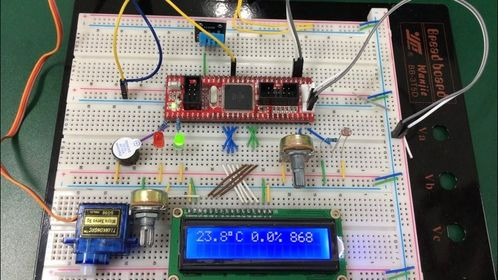

#### 화재알리미

---

| 용도   | 부품명                       |
| ------ | ---------------------------- |
| Core   | ATmega 128, ISP              |
| INPUT  | 온도센서, 가스센서, 불꽃센서 |
| OUTPUT | 부저, 팬, 서보모터, 릴레이   |
| 통신   | 블루투스 모듈                |

##### 핀 연결

PA0~PA2 : LCD 제어핀
PA4~PA7 : LCD 데이터핀
PB5 : 서보모터
PC0 : 부저
PC1 : 팬모터
PC2 : 릴레이
PD0 : 온도 센서(DHT11)
PF0 : 불꽃 센서
PF1 : 가스 센서

##### 테스트 사진

##### 센서

ATmega의 ADC기능을 사용해서 0~1023의 값으로 입력받는다.

##### 상태 확인

센서로부터 받아온 값들을 바탕으로 상태를 확인한다. 일반적인 상태 범위에 해당하지 않을 경우에는 상황에 맞게 팬, 모터, 릴레이를 동작시킨다. 

만약, 화재가 발생했을 경우에는 부저를 울리고 블루투스로 화재가 발생했다고 신호를 보내준다.

##### 블루투스

블루투스를 통해서 연결된 앱으로 현재의 상태를 확인할 수 있고, 앱을 통해서 원격으로 팬, 모터, 릴레이를 제어할 수 있다.

uart를 사용해서 통신을 하기 때문에, 중간에 아두이노를 연결해서 컴퓨터에서도 uart로 보낸 값을 확인할 수 있다.

##### PyQt

uart통신을 통해서 받아온 데이터를 사용자가 볼 수 있도록 파싱해서 표시해준다.

직접 데이터를 보고 팬, 모터, 릴레이를 버튼으로 손 쉽게 제어할 수 있다.